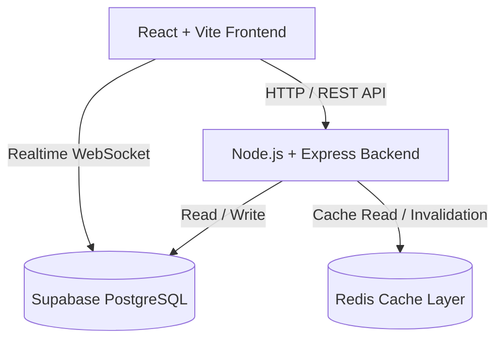

# ResidencyHub Architecture & Technical Design

## 1. Executive Summary

**ResidencyHub** is a high-performance, real-time hotel and residency management platform. Built with a layered Node.js/Express backend and a modern React/Vite frontend, the application is backed by Supabase (PostgreSQL with Row Level Security and Realtime WebSocket subscriptions) and an external Redis distributed cache layer.

---

## 2. System Architecture



### Core Technologies
- **Frontend**: React 19, Vite, TailwindCSS, Framer Motion, Lucide Icons, Axios.
- **Backend**: Node.js, Express, Helmet, CORS, Morgan.
- **Data & Auth**: Supabase PostgreSQL, Row Level Security (RLS), Supabase Auth.
- **Cache**: Redis distributed key-value store (`redis` v4 client with automatic reconnection).
- **Realtime**: Supabase Realtime WebSocket channel for instant room status synchronization.

---

## 3. Directory Layout & Module Responsibilities

```text
ResidencyHub/
├── client/
│   ├── src/
│   │   ├── components/       # Reusable UI components
│   │   │   ├── common/       # Modal, Spinner, Generic controls
│   │   │   ├── owner/        # FloorGrid, RoomCard, BookingForm, CheckInOutPanel
│   │   │   └── admin/        # Admin structure, residency settings
│   │   ├── constants/        # Centralized presets (roomPresets.js)
│   │   ├── context/          # State providers (AuthContext, ResidencyContext)
│   │   ├── hooks/            # Dedicated domain hooks (useBookingForm, useCheckInOut)
│   │   ├── pages/            # Page-level containers (owner, admin, auth)
│   │   ├── services/         # Client HTTP API adapters (floor, room, booking, etc.)
│   │   └── utils/            # Shared helpers (csvExport.js, dateFormat.js)
├── server/
│   ├── src/
│   │   ├── config/           # Centralized configuration (env.js, redis.js, supabase.js)
│   │   ├── controllers/      # Thin HTTP request/response handlers
│   │   ├── middleware/       # Auth, role check, and centralized error handling
│   │   ├── routes/           # Express route definitions
│   │   ├── services/         # Core business logic, queries & cache coordination
│   │   └── utils/            # Structured logger, error classes
├── supabase/
│   └── migrations/           # Database schemas and historical migrations
└── docs/                     # Architectural documentation
```

---

## 4. Backend Service Layer Pattern

The backend follows a strict **Controller-Service-Repository** pattern:

```text
HTTP Request ──> Route ──> Middleware (Auth / Role) ──> Controller ──> Domain Service ──> Redis / Supabase
                                                                              │
HTTP Response <────────────────────────────────────────────────────────────────┘
```

1. **Routes (`routes/*.routes.js`)**: Map HTTP verbs and endpoints to controller methods; attach authentication and authorization middleware.
2. **Controllers (`controllers/*Controller.js`)**: Thin HTTP adapters. Parse query parameters and request bodies, invoke domain services, and return standardized JSON payloads with correct HTTP status codes.
3. **Services (`services/*.service.js`)**: Encapsulate all business logic, Supabase database queries, billing rules, and Redis caching/invalidation.
   - `floor.service.js`: Floor hierarchies and live occupancy statistics computation.
   - `room.service.js`: Room management, category resolution, and cascading deletions.
   - `booking.service.js`: Check-in, 24-hour slab checkout billing calculation, and lifecycle management.
   - `customer.service.js`: Guest profiles, autosuggest search, and booking histories.
   - `revenue.service.js`: Daily, floor, and category revenue aggregations.
   - `billing.service.js`: Pure billing calculations (24-hour stay slabs with hourly overage rules).
   - `cache.service.js`: Redis get/set/invalidation abstraction with graceful fallback if Redis is unavailable.
4. **Error Handling (`middleware/error.middleware.js` & `utils/errors.js`)**: Centralized error middleware translating domain errors (`AppError`, `NotFoundError`, `ConflictError`) into consistent `{ error: message }` responses.

---

## 5. Redis Caching & Invalidation Architecture

### Cache Keys & TTLs
| Key Pattern | TTL | Description |
| :--- | :--- | :--- |
| `residency:{residencyId}:floors` | 300s (5m) | Complete floor list with room hierarchy and occupancy stats |
| `residency:{residencyId}:rooms:{floorId}` | 300s (5m) | Rooms filtered by floor or all |
| `residency:{residencyId}:room:{roomId}` | 120s (2m) | Single room details with active booking snapshot |
| `residency:{residencyId}:room_categories` | 600s (10m) | Room category definitions and base pricing |
| `residency:{residencyId}:customers:search:{query}` | 180s (3m) | Autosuggest search results for customer name/phone |
| `residency:{residencyId}:dashboard:today_stats` | 60s (1m) | Today's check-ins, check-outs, and revenue |
| `residency:{residencyId}:revenue:{filters}` | 180s (3m) | Filtered revenue aggregations and charts data |

### Cache Invalidation Strategy
Any state-mutating operation (create booking, check-in, check-out, cancel, update room, update floor) executes precise cache invalidations:
- `invalidateFloorsCache(residencyId)`: Purges floor tree and dashboard stats.
- `invalidateRoomsCache(residencyId)`: Purges room listings, single room caches, floor tree, and dashboard stats.
- `invalidateBookingsCache(residencyId)`: Purges room caches, floor tree, dashboard stats, and revenue aggregations.
- `invalidateCustomerSearchCache(residencyId)`: Purges customer autosuggest search queries.

If Redis is unreachable or fails, all services **gracefully degrade** to directly querying Supabase without interrupting client requests.

---

## 6. Frontend Architectural Principles

1. **Separation of Concerns**:
   - Complex component logic is extracted into custom hooks (`useBookingForm`, `useCheckInOut`).
   - Presentation components focus on rendering, styling, and animations.
2. **Centralized Services**:
   - All backend calls are organized in `client/src/services/` (`floorService.js`, `roomService.js`, `bookingService.js`, `customerService.js`, `revenueService.js`).
3. **Optimistic Updates & Realtime Sync**:
   - `ResidencyContext` subscribes to Supabase PostgreSQL change events (`UPDATE` / `INSERT` on `rooms` and `floors`) to update the live UI instantly when room statuses change.
   - Broadcast channel syncs state across multi-tab sessions in real time.
